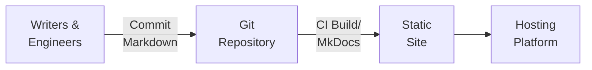

# Docs-as-code case study: *[Acme Corp]*

## Executive summary

!!! tip inline end "Confidentiality"

    This is a sanitized case study of a documentation system I built from scratch. No NDAs were harmed in the making of this site.

I designed and maintained a docs‑as‑code platform for *[Acme Corp]* using MkDocs and Material for MkDocs.
The system uses Git workflows, CI validation, and lightweight theme overrides to keep documentation reliable, reviewable, and easy to evolve.
The result is a predictable publishing cycle with consistent standards, accessible UI patterns, and fast feedback for contributors.

## Starting problem

I needed to bring existing documentation from several teams and formats into one system while keeping writing standards consistent.
I needed tooling that would catch broken links and style drift early, without adding friction for authors.
The system and workflows also had to support multi‑project repositories and a growing contributor base of both technical and non-technical authors.

## Design decisions


I knew I wanted a docs-as-code system and workflows.
I chose an MkDocs + Material stack, with Python dependencies pinned in `requirements.txt`.

For technical accuracy and consistency of voice, I required pull requests for every merge from a working `feature/*` branch to a `dev/*` branch.
This also mirrored company policy for similar merges in other repositories.

!!! tip inline end ""

    NDAs prevent me from showing real PR examples or CI screenshots here.

A Jenkins pipeline validated structure, links, and style in the `dev/*` branches, and deployments ran from the `main` branch.
By policy, merges to `main` were only allowed after a successful `dev/*` build; we kept governance in the review and CI stages to catch problems early.

Accessibility stayed in scope throughout: readable typography, high contrast, and a few small, targeted JavaScript improvements.

## Why this approach

* **Docs‑as‑code** aligns with existing engineering practices and keeps history and review in Git.
* **Material for MkDocs** provides an accessible, extensible base with minimal maintenance.
* **Plugin‑driven** features cover search, redirects, tabbed content, syntax highlighting, and annotated examples.
* **Lightweight overrides** reduce upgrade risk while allowing brand‑level adjustments.

## Architecture



Key decisions:

* Single repository per product with `docs/`, `mkdocs.yml`, and optional `overrides/`.
* MkDocs build with `--strict` to fail on structural or internal‑link errors.
* LinkChecker for external links; Vale for style and terminology.
* Small template overrides only where needed.

## Implementation highlights

### Theme and features

``` { .yaml title="mkdocs.yml (sanitized excerpt)" }
theme:
  name: material
  logo: img/home_icon.png
  favicon: img/favicon.png
  font:
    text: Noto Sans
    code: Courier Prime
  features:
    - navigation.path
    - navigation.tabs
    - navigation.top
    - content.code.annotate
    - content.code.copy
    - content.tabs.link
    - content.tooltips
plugins:
  - search
  - glightbox
  - redirects
markdown_extensions:
  - admonition
  - toc:
      title: On this page...
      permalink: 🔗
      permalink_title: Link to this heading
  - pymdownx.highlight
  - pymdownx.tabbed
  - pymdownx.snippets:
      check_paths: true
extra_css:
  - assets/stylesheets/extra.css
extra_javascript:
  - assets/javascripts/extra.js
```

### Authoring patterns

Tabbed content keeps platform variants together.

=== "macOS"
    
    Run `install.sh`.

=== "Windows"

    Run `install.bat`.

Copy buttons and annotated code support command‑heavy topics.

``` {.bash .example title="Install tools"}
pip install -r requirements.txt  # (1)!
```

1.   Installs MkDocs, dependencies, and plugins

``` {.bash .example title=" Build the site with strict validation"}
mkdocs build --strict  # (1)!
```

1.   Fails on broken links or invalid paths


### Styling and small JS

``` {.css title="extra.css (sanitized excerpt)"}
.md-banner {
  background-color: #004b7a;
  text-align: center;
}
.md-header__inner {
  padding-top: 0.25rem;
  padding-bottom: 0.25rem;
}
```

``` {.js title="extra.js (sanitized excerpt)"}
document.addEventListener("DOMContentLoaded", () => {
  for (const link of Array.from(document.querySelectorAll(".md-typeset a[href^=http]"))) {
    link.target = "_blank";
    link.rel = "noopener noreferrer";
  }
  for (const c of Array.from(document.querySelectorAll(".md-typeset code"))) {
    c.setAttribute("role", "text");
    c.setAttribute("aria-label", "Code");
  }
  for (const cb of Array.from(document.querySelectorAll(".md-typeset pre > code"))) {
    cb.setAttribute("role", "region");
    cb.setAttribute("aria-label", "Code block");
  }
});
```

## Workflow and governance

1.   Author works in a `feature/*` branch (1) and previews locally with `mkdocs serve`.
    { .annotate }

    1.   Short‑lived task branches tied to Jira issues.

1.   Open PR into the appropriate `dev/*` (1) branch for review.
    { .annotate }

    1.   Active branches for ongoing updates. CI builds generate internal previews.

1.   PR approval creates merge commit in `dev/*`.
1.   Jenkins pipeline runs on `dev/*`: install dependencies → `mkdocs build --strict` → external link check → Vale → artifacts and notifications.
1.   During release prep, assuming the latest CI build in the `dev/*` branch succeeded, merge the `dev/*` branch into `main` (1) and deploy.
    { .annotate }

    1.   Production documentation. Reviewed and validated content only.


1.   Feedback loop:
    BugHerd lets non‑technical reviewers comment directly on the rendered pages.
    Each BugHerd card links back to the source page for quick triage, and fixes move through the same PR and CI path.


## Risks and trade‑offs

MkDocs' Lunr-based client-side search sacrifices advanced features like exact phrase matching in exchange for a zero-infrastructure solution that's fast, works entirely in the browser, and can be deployed anywhere static files can be hosted.
That 'anywhere' includes downloaded or in-app documentation, which modern browsers prevent due to cross-file access restrictions.
With input from stakeholders, I chose this trade-off because a significant subset of customers were constrained to airgapped environments, where most client-side search would not have functioned at all.

I kept pre-commit hooks out of scope to keep tooling simpler for reluctant contributors.
That shifted enforcement to CI, so errors surface after a push instead of before a commit.
To mitigate this, we required PR review for technical accuracy and voice, and ran the CI builds in `strict` mode with Vale and Linkchecker.
This caught broken links, structure issues, and style drift before anything reached `main`.

Merges to `main` weren't restricted, so that anyone on the team could publish if needed.
This of course carries its own risks: if anyone can publish, then anyone might publish!
We mitigated this by making the deployment itself a manual step, and with policy:

-   Merge to `main` only as part of release prep, and only after a successful `dev/*` build.
-   Deploy only from `main`, using a manual deploy job.

I kept theme overrides minimal. That traded fine-grained brand control for easy tooling upgrades and low maintenance.

## Outcomes

The program now runs on a predictable publishing cadence aligned with product releases.
Technical and non-technical authors are willing and able to contribute to the documentation and can see in real time what they are creating.
Strict-mode builds and external link checks surface errors early in the cycle.
Vale keeps terminology and tone consistent across teams.
The UI remains uniform and accessible through tooling updates, with small, maintainable refinements where needed.
