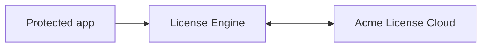

# Architecture: Acme licensing system

This page explains how Acme licensing fits together—the parts, how they interact, and the trade-offs behind common setups. It’s a mental model, not a set of steps.

## What this system is primarily for

Acme is designed first for **individual license management** through **Acme License Hub**:

- You **redeem** entitlements to your account.
- You **activate** licenses to a **location** that your machine can use.
- You **run** protected apps, which verify the license via the installed **Acme License Engine**.

Team/shared use (via a server) is an additional feature layered on top of this core model.

## Core concepts

**Account**  
Your identity and ownership of licenses.

**License and seats**  
A license can include one or more **seats** (concurrent uses). Seats are granted temporarily to apps as **leases**.

**Locations**  
Where a license seat lives when active:

- **Acme dongle** — hardware you control, attached by USB.
- **Acme License Cloud** — a session you open in Hub.
- **Server (shared)** — seats stored on a dongle attached to a server host; clients lease from that server.

**Acme License Hub**  
The desktop app for individuals and admins: sign in, redeem, activate/deactivate, connect to servers, view state.

**Acme License Engine**  
The runtime installed on machines that enables licensed apps to check entitlements.

## Typical flows

### Individual use: local dongle

You activate a license to a dongle connected to your machine. Apps talk to the dongle through the Engine and run offline.

```mermaid
flowchart LR
  App[Protected app] --> Engine[License Engine]
  Engine <---> Dongle[Acme dongle (local)]
```

Properties: portable, offline, simple to reason about. Limited central visibility.

### Individual use: Acme License Cloud

You sign in and open a Cloud session in Hub. While the session is open, Cloud-enabled licenses are available to your apps.



Properties: nothing to plug in, quick to start, requires stable internet.

### Shared use: server with attached dongle

A server host has a dongle holding seats. Client machines connect to that server and receive time-bound leases while their apps run.

```mermaid
flowchart LR
  subgraph Client
    App[Protected app] --> Engine[License Engine]
  end
  Engine <---> Server[License server]
  Server <---> SDongle[Acme dongle (on server host)]
```

Properties: central control and audit, shared seat pool, depends on LAN/VPN reachability.

## Discovery and connection (server feature)

* **Public (discoverable)**: the server announces itself on the LAN; clients pick it from a list.
* **Private**: no announcement; clients import a configuration file or enter the server address.

Discovery affects how clients **find** the server. It does not change how licenses are enforced.

## Leases and lifecycles

* **Request**: when an app launches, the client asks the location (local dongle, Cloud, or server) for permission.
* **Grant**: if a seat is available and policy allows it, the client receives a **lease**.
* **Renew**: the client refreshes the lease while the app is running.
* **End**: the lease is released when the app closes or times out.

Common denial reasons (conceptual): no seats free, policy limits (per-client), missing identity/password (server), version not eligible, network loss during renewal (Cloud/server).

## Choosing a location

Choose based on how you work most of the time:

| Primary need                   | Recommended location            | Why                                                             |
| ------------------------------ | ------------------------------- | --------------------------------------------------------------- |
| Portable, offline, single-user | **Local Acme dongle**           | Works without internet; easy to move between machines.          |
| Always-online, simple setup    | **Acme License Cloud**          | No hardware; session-based access on any machine you sign into. |
| Shared pool for many users     | **Server with attached dongle** | Centralized seats and policy; visibility for admins.            |

Note for shared use: seats must live on the **server host’s dongle** for clients to lease across the network.

## Identity, access, and audit (server feature)

* **Access password** controls who can connect.
* **Client identity** (username, machine name, or both) ties leases to people and devices.
* **Statistics and logs** provide visibility: connections, leases, denials, and trends.

## Boundaries and failure domains

Think in layers when reasoning about issues:

1. **Location** — Where does the seat live (local dongle, Cloud, server’s dongle)?
2. **Reachability** — Can the client reach that location (USB present, internet up, server reachable across subnet/VPN/firewall)?
3. **Policy** — Password required? Identity required? Per-client limits?
4. **Eligibility** — Is the product/version Cloud-enabled or server-eligible?

This sequence maps directly to troubleshooting.

## Trade-offs at a glance

* **Local dongle**: highest independence and offline capability; least central oversight.
* **Cloud**: lowest friction; depends on internet; session opens/closes matter.
* **Server**: strongest central control and audit; requires stable LAN/VPN and server operations.

## Related reading

* Individual tasks: [Redeem an activation code](../how-to/licenses/redeem.md), [Activate a license](../how-to/licenses/activate.md), [Deactivate a license](../how-to/licenses/deactivate.md)
* Server concepts: [Server Admin settings](../reference/server-admin.md)
* Troubleshooting: [Server not discovered](../troubleshooting/discovery.md), [VPN and subnets](../troubleshooting/vpn.md), [Firewalls](../troubleshooting/firewalls.md)
